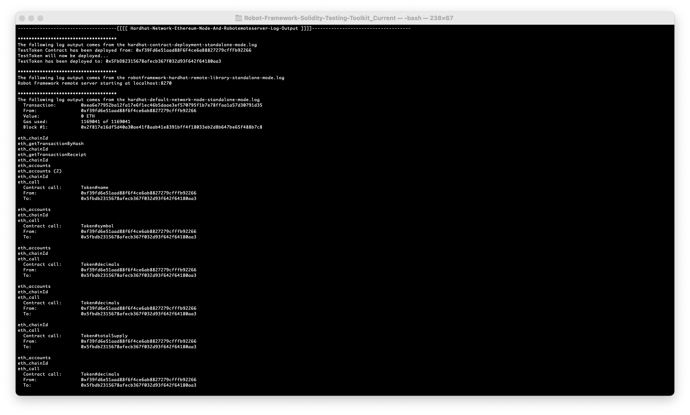
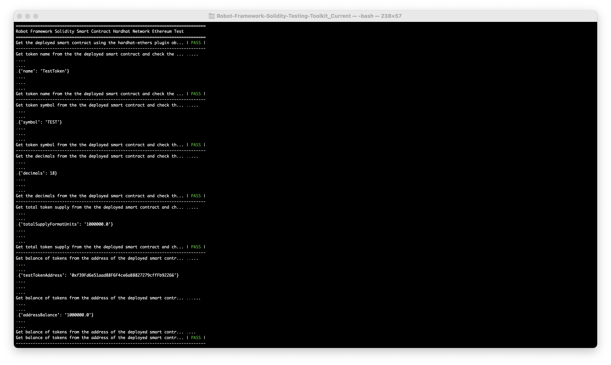
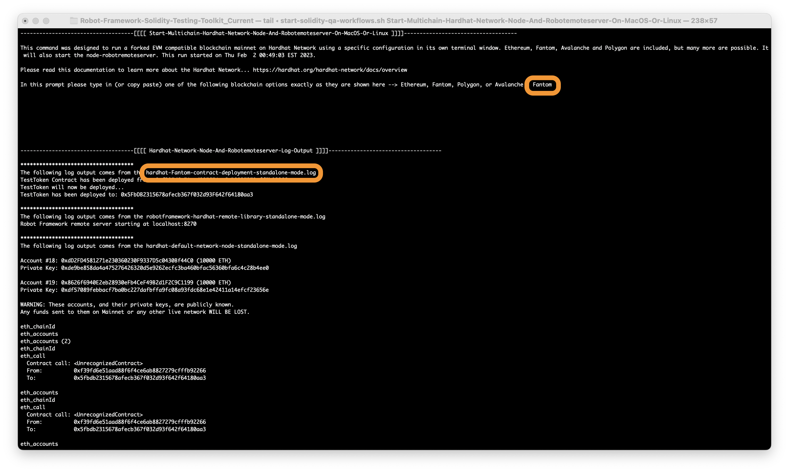
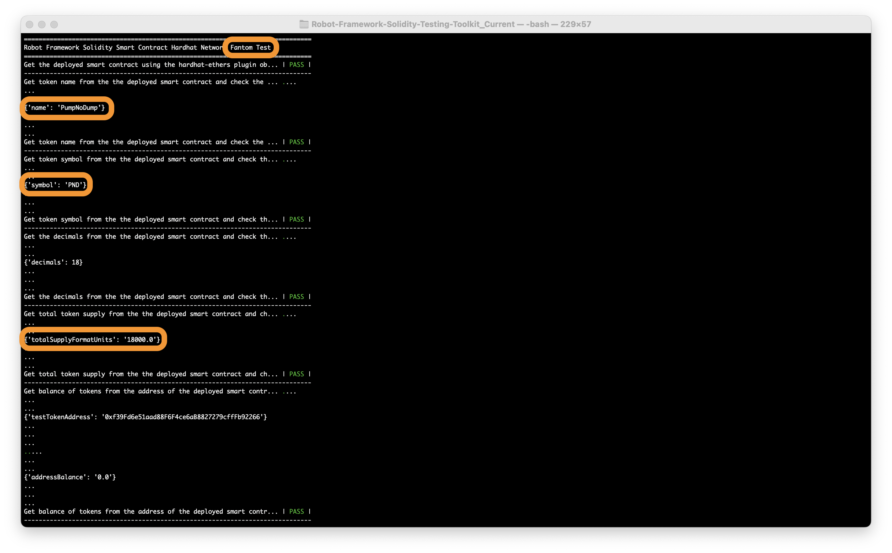
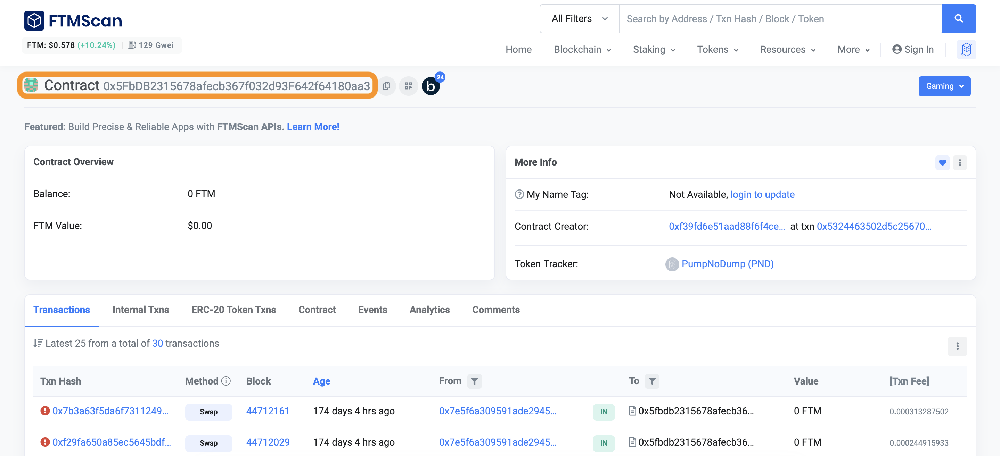
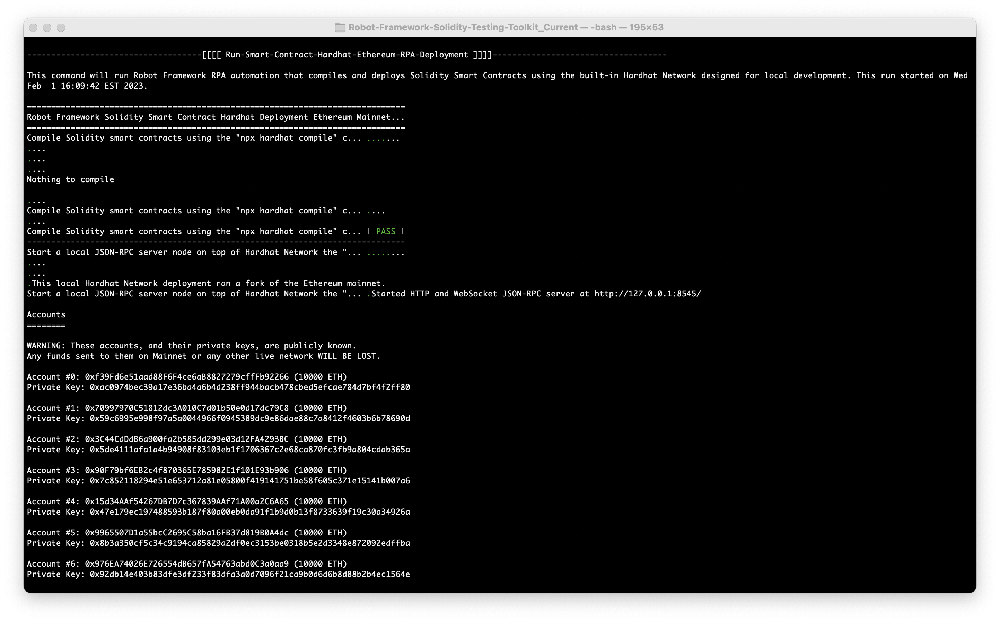

# Robot Framework Solidity Testing Toolkit


## Disclaimer

By using this software you understand the risks of Web3 and blockchain technologies. This toolkit is intended for testing and learning concepts in the Web3 and blockchain industry. **You are responsible for your own personal cryptocurrency funds and Web3 wallet private keys, and it is your personal responsibility to protect them.** Any misuse or mishandling of this software on any of the EVM compatible blockchain mainnets or testnets is at your own risk.

Also just a **friendly warning, DO NOT ATTEMPT TO SEND FUNDS to any of the** [**20 test accounts**](https://dev.to/alex_bobes/making-an-ethereum-bot-a-step-by-step-guide-3ol4) provided by `hardhat`. 

## Ethereum set the standard, but cross-chain is the future.

[The capabilities of the Solidity programming language and the Ethereum platform in general are vast and growing every day](https://soliditylang.org/). One of the common usecaes for Ethereum has been to approach it as a gigantic Web3 backend system. The very simple OpenZeppelin ERC20 `TestToken` and other smart contract examples included in this toolkit are tiny slices of the bigger picture in comparison to what is being used today [in Web3 and DeFi production environments](https://dappradar.com/). In general when you approach people on the street and they hear the word `Ethereum`, the reactions you would probably get from them is "oh that's the thing I can buy on Coinbase or Binance and send to my parents on the other side of the world" or "that's the blockchain network that has all those shit-coins right?". In reality, Ethereum was built for much immensely grand designs than the simple monetary usecases that most people are familiar with. [Vitalik Buterin and the other Ethereum co-founders originally sought to create a "World Computer".](https://cointelegraph.com/news/the-mind-behind-the-world-computer-ethereums-vitalik-buterin) As you browse through this documentation you will notice that **I am not attempting to even try to create "generic keywords" for Solidity and the "World Computer" that smart contracts are deployed to.** Also the Ethereum platform has become so popular that [it is being bridged](https://ethereum.org/en/bridges/) into many other types of blockchains, and [current Web3 protocols are evolving towards cross-chain communication](https://www.alchemy.com/overviews/cross-chain-vs-multichain). I have usescases of my own for cross-chain EVM (Ethereum Virtual Machine) projects and this toolkit, but I wanted to share my non-specific strategies here and possibly hear your thoughts too if you want to reach out to me on [Robot Framework's Slack Group](https://robotframework.slack.com/).

This [multichain test toolkit](https://github.com/jg8481/Robot-Framework-Solidity-Testing-Toolkit) contains automation that helps **locally test EVM compatible smart contracts written in Solidity, [deploy them using a multichain approach](https://roycewells.io/writing/multichain-development/), and has the basic building blocks for creating blockchain event monitoring bots**. One of the primary components is a custom-made `robotframework-hardhat-remote-library.js` that was built using [hardhat]() and [ethers.js]() libraries for [Web3](https://ethereum.org/en/web3/) development, and combined together using [comick's node-robotremoteserver](https://github.com/comick/node-robotremoteserver). This toolkit has been designed to [create local mainnet forks through hardhat](https://hardhat.org/hardhat-network/docs/guides/forking-other-networks) for deploying smart contracts on multiple types of blockchains that support the EVM. I have included small checks and basic RPA automation scripts that work for Ethereum, Fantom, Avalanche, Polygon, but they can be adapted to cover many others as well by simply adjusting minor `hardhat` CLI options and altering the provided config files. 

### Why Robot Framework? Why not MochaJS etc.?

[MochaJS](https://mochajs.org/) is a good and flexible test framework, but it's not easy to figure out how it can handle the following types of tests...
- Model-based Testing
  - https://www.harryrobinson.net/
  - https://graphwalker.github.io/
- [Chaos Testing running in parallel with other tests](https://robocon.io/#online-robot-framework-and-endpoint-detection-agents-at-secureworks)
- [Parallel tests that require the tester to measure system resources while running various types of tests at the same time](https://github.com/jg8481/Getting-Started-Robotframework-AppiumLibrary-RoboCon-2021-And-2022)

A lot of the automation in this repo is influenced by my [Robot-Framework-Lone-Tester-Strategies-RoboCon-2019](https://github.com/jg8481/Robot-Framework-Lone-Tester-Strategies-RoboCon-2019), [Tool-Strategies-Lone-Testers-Test-Leadership-Congress-2019](https://github.com/jg8481/Tool-Strategies-Lone-Testers-Test-Leadership-Congress-2019), and [Getting-Started-Robotframework-AppiumLibrary-RoboCon-2021-And-2022](https://github.com/jg8481/Getting-Started-Robotframework-AppiumLibrary-RoboCon-2021-And-2022) workshops. More information about these RoboCon workshops can be found on [robocon.io](https://robocon.io/#workshops). In the future I plan to expand this toolkit into the following areas.
- Create a `robotframework-truffle-remote-library.js` using the [truffle toolkit](https://trufflesuite.com/), and design similar features that are found in  `robotframework-hardhat-remote-library.js`
- Create more static analysis, security, and vulnerability scanning RPA automation integrated with popular tools in the Web3 and blockchain industry
- Create RPA and `robotframework-hardhat-remote-library.js` powered cross-chain bots utilizing [Infura](https://infura.io/), [hardhat toolkit](https://hardhat.org/), and [ethers.js](https://github.com/ethers-io/ethers.js/)
- Attempt to create Robot Framework automation utilizing the [foundry toolkit](https://github.com/foundry-rs/foundry)
- Create Metamask automation using [SeleniumLibrary](https://github.com/robotframework/SeleniumLibrary) and [robotframework-browser (a Playwright library)](https://github.com/MarketSquare/robotframework-browser)
- Create a Robot Framework Model-based Testing example utilizing similar concepts found in my [PaBot-Android-Device-Graphwalker-Examples.robot](https://github.com/jg8481/Getting-Started-Robotframework-AppiumLibrary-RoboCon-2021-And-2022/blob/main/Workshop-Examples/Tests/Workshop-Part-Two/PaBot-Android-Device-Graphwalker-Examples.robot#L23)
- Play around with some Chaos Testing ideas for dApps

### Technical Requirements

The following are the basic technical requirements needed to run these automated checks. Please note that this entire toolkit was developed on a MacOS machine, but should also work for most Linux users (preferably most current Ubuntu LTS versions etc.) and I would keep an eye on whatever the `hardhat` or `truffle` (source: https://github.com/trufflesuite/ganache-ui/releases) communities recommend for Linux distributions.
- Python 3 -> https://www.python.org/downloads/
- NodeJS 18 -> https://nodejs.org/en/ or use https://github.com/nvm-sh/nvm
  - If you're using `nvm`, you can run `nvm install 18` to install version 18
  - If you are using a MacOS or Linux machine, the `Install-Tools-On-MacOS-Or-Linux` command below is a quick install
- Robot Framework -> https://robotframework.org
- Create your own [free Infura account](https://www.infura.io/) and **set up your own API key**
- Replace all instances of `<your-infura-api-key-goes-here>` in the `Avalanche.config.js` and `Ethereum.config.js` configuration files

## Quick Start Guide

Before running any of the automation first make sure that all of the basic technical requirements are installed and working, then you can run `bash ./start-solidity-qa-workflows.sh Install-Tools-On-MacOS-Or-Linux`. After the installation script successfully finishes you should be able to run any of the following commands without problems.

```
You can view just this help menu again (without triggering any automation) by running 'bash ./start-solidity-qa-workflows.sh -h' or 'bash ./start-solidity-qa-workflows.sh --help'.

---->>>> Local Solidity Test Environment Setup Commands <<<<----
bash ./start-solidity-qa-workflows.sh Install-Tools-On-MacOS-Or-Linux
bash ./start-solidity-qa-workflows.sh Start-Default-Hardhat-Network-Ethereum-Node-And-Robotemoteserver-On-MacOS-Or-Linux
bash ./start-solidity-qa-workflows.sh Start-Multichain-Hardhat-Network-Node-And-Robotemoteserver-On-MacOS-Or-Linux
bash ./start-solidity-qa-workflows.sh Stop-All-Local-Network-Nodes-And-Delete-Logs-On-MacOS-Or-Linux"

---->>>> Solidity Static Analysis And Security Testing Commands <<<<----
bash ./start-solidity-qa-workflows.sh Run-Solidity-Static-Analysis
 
---->>>> Hardhat Deployment Commands Powered by Robot Framework RPA (NOTE: These scripts are capable of deploying to Mainnets or Testnets!) <<<<----
bash ./start-solidity-qa-workflows.sh Run-Smart-Contract-Hardhat-Ethereum-RPA-Deployment
bash ./start-solidity-qa-workflows.sh Run-Smart-Contract-Hardhat-Fantom-RPA-Deployment
bash ./start-solidity-qa-workflows.sh Run-Smart-Contract-Hardhat-Polygon-RPA-Deployment
bash ./start-solidity-qa-workflows.sh Run-Smart-Contract-Hardhat-Avalanche-RPA-Deployment

---->>>> Interactive Tests For Deployed Smart Contracts Using Hardhat (NOTE: These tests can run on multiple EVM Compatible Blockchains!) <<<<---- 
bash ./start-solidity-qa-workflows.sh Run-Smart-Contract-Interactive-Tests-On-Local-NonForked-Hardhat-Network
bash ./start-solidity-qa-workflows.sh Run-Smart-Contract-Interactive-Tests-On-Forked-Mainnet-Hardhat-Network 
```
### [Example Workflow 1] -> Deploy then test a smart contract using the built-in Hardhat Network Ethereum Node and node-robotremoteserver (on MacOS or Linux)
From the commands posted above, here is an example workflow (with screenshots) below that will work reliably as long as both the basic technical requirements and the `bash ./start-solidity-qa-workflows.sh Install-Tools-On-MacOS-Or-Linux` command have been completed without issues.
- First, open two terminals and keep both open the entire time
- In one of the terminals, run the `bash ./start-solidity-qa-workflows.sh Start-Default-Hardhat-Network-Ethereum-Node-And-Robotemoteserver-On-MacOS-Or-Linux` command then check that the output matches what is shown in the following screenshot 

- In the other terminal, run the `bash ./start-solidity-qa-workflows.sh Run-Smart-Contract-Interactive-Tests-On-Local-NonForked-Hardhat-Network` command then check that the output matches what is shown in the following screenshot 


### [Example Workflow 2] -> Fork Fantom Mainnet, deploy, then test an existing smart contract using the Hardhat Network Fantom fork and node-robotremoteserver (on MacOS or Linux)
From the commands posted above, here is an example workflow (with screenshots) below that will work reliably as long as both the basic technical requirements and the `bash ./start-solidity-qa-workflows.sh Install-Tools-On-MacOS-Or-Linux` command have been completed without issues.
- First, open two terminals and keep both open the entire time
- In one of the terminals, run the `bash ./start-solidity-qa-workflows.sh Start-Multichain-Hardhat-Network-Node-And-Robotemoteserver-On-MacOS-Or-Linux` command, follow the instructions by entering `Fantom`, then check that the output matches what is circled in the following screenshot 

- In the other terminal, run the `bash ./start-solidity-qa-workflows.sh Run-Smart-Contract-Interactive-Tests-On-Forked-Mainnet-Hardhat-Network` command then check that the output matches what is circled in the following screenshot 

- This test will interact with someone else's existing token project (**contract address**: `0x5FbDB2315678afecb367f032d93F642f64180aa3`) on Fantom Mainnet called ["PumpNoDump (PND)"](https://ftmscan.com/address/0x5fbdb2315678afecb367f032d93f642f64180aa3). **FYI, the PND token is NOT mine and I am not associated with it at all**


### [Example Workflow 3] -> Use Robot Framework RPA to do only the deployment using Hardhat (on MacOS or Linux)
From the commands posted above, here is an example workflow below that will work reliably as long as both the basic technical requirements and the `bash ./start-solidity-qa-workflows.sh Install-Tools-On-MacOS-Or-Linux` command have been completed without issues.
- Only one terminal is needed
- Run the `bash ./start-solidity-qa-workflows.sh Run-Smart-Contract-Hardhat-Ethereum-RPA-Deployment` command then check that the output matches what is shown in the following screenshot 


Results for the example workflows above can be found in the `...-log.html` files stored in the [logs](https://github.com/jg8481/Robot-Framework-Solidity-Testing-Toolkit/tree/main/solidity-hardhat-multichain-tools/logs) folder.

## Windows User Advice

All Windows users should please read my [NOTES.md](https://github.com/jg8481/Robot-Framework-Solidity-Testing-Toolkit/blob/main/notes-images-and-demonstrations/NOTES.md) file for more details.